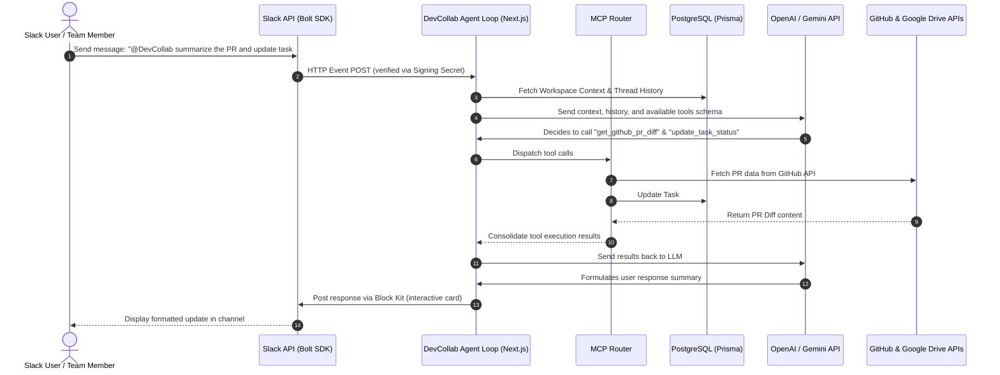

# 📋 Project Scope: DevCollab AI Workspace Intelligence Agent

> **An AI-powered, Slack-native Workspace and Project Intelligence Platform built for modern engineering organizations.**

---

## 🔍 Overview

**DevCollab AI Workspace Intelligence Agent** is an all-in-one, Slack-native AI platform designed to transform Slack from a simple chat application into the central operating system of your engineering organization. 

Developed specifically for the **Slack Agent for Organizations** hackathon track, DevCollab bridges the gap between conversational communication and transactional engineering tools. It leverages the state-of-the-art **Model Context Protocol (MCP)** to serve as an intelligent project manager, team coordinator, code generator, and organizational knowledge assistant. By putting your development tools directly into Slack, DevCollab helps teams manage workspaces, projects, tasks, and codebases entirely through natural language.

| Aspect | Details |
| :--- | :--- |
| **Project Name** | DevCollab AI Workspace Intelligence Agent |
| **Hackathon Track** | Slack Agent for Organizations |
| **Target Audience** | Engineering Teams, Startup Organizations, Agile Squads, Product Managers |
| **Key Innovations** | Slack-native AI Agent Loop, Model Context Protocol (MCP) server integration, Context-aware knowledge search |

---

## ⚠️ Problem Statement

Modern product and engineering teams suffer from severe tool fragmentation. They are forced to jump across multiple disconnected platforms daily:
*   **Communication:** Slack, Email
*   **Version Control:** GitHub, GitLab
*   **Documentation & Files:** Google Drive, Notion, Confluence
*   **Project Management:** Jira, Linear, Trello

This fragmentation creates three primary challenges:
1.  **Information Fragmentation (Silos):** Critical decisions, specifications, code PR statuses, and task updates are scattered across different environments. Search is siloed, making it extremely difficult to build a single source of truth.
2.  **Context-Switching Overhead:** Developers waste up to 20-30% of their cognitive load switching tabs and windows between checking issue trackers, updating tasks, reviewing code changes, and reporting status back in Slack.
3.  **Inefficient Coordination:** Team status updates, standups, and roadmaps require manual compilation. Project managers spend hours chasing developers for updates, leading to outdated project boards and inaccurate progress metrics.

---

## 💡 Solution

**DevCollab AI** solves these challenges by creating a **Slack-native intelligence layer** that acts as your team's autonomous coordinator and assistant.

Instead of navigating complex web dashboards, teams converse directly with DevCollab inside Slack. The agent handles administrative task management, retrieves code context, summaries workspace files, and updates project status behind the scenes. 

By linking real-time databases and third-party tools (via **MCP**) with natural language processing, DevCollab empowers teams to:
*   Create and assign tasks in natural language (e.g., *"Assign a high-priority bug ticket to @Sarah for the dashboard crash"*).
*   Synthesize cross-tool data instantly (e.g., *"Summarize the feedback on the API design from the Google Drive doc and check if the GitHub repo has implemented it"*).
*   Generate automated standups and project risk analysis based on real-time activity.

---

## ✨ Core Features

DevCollab is built around 12 core functional pillars:

### 1. 🏢 Workspace Management
*   **Central Control:** Create, manage, and isolate organizational workspaces directly from Slack or a unified web console.
*   **Workspace Routing:** Map specific Slack channels to isolated workspace entities to maintain security boundaries and prevent data contamination.

### 2. 📊 Project Management
*   **Board Orchestration:** Create projects, track milestones, and view delivery roadmaps.
*   **Sprint Scheduling:** Schedule and view active sprints and release cycles via conversation.

### 3. 🎯 Task Management
*   **NL Task CRUD:** Create, read, update, and delete tasks using simple, conversational commands.
*   **Interactive Cards:** Rich Slack Block Kit UI for rendering tasks with interactive dropdowns to modify status, assignee, and priority on the fly.

### 4. 👥 Team Management
*   **Resource Allocation:** Manage roles, monitor individual bandwidth, and balance workloads across team members.
*   **Auto-assignment:** Intelligently suggest assignees based on current active load and past expertise.

### 5. 🤖 Slack Agent Integration
*   **Assistant Panel & Direct Mentions:** Built-in Slack AI UI panel integration that acts as an ambient helper.
*   **Home Tab Dashboard:** A personalized, real-time home dashboard tab inside Slack showing assigned tasks, upcoming deadlines, and active project stats.

### 6. 📝 AI-powered Task Generation
*   **Transcript-to-Ticket:** Automatically analyze channel discussions or standup logs to extract action items and draft ready-to-publish tickets.
*   **Estimations & Checklists:** AI-suggested due dates, priority levels, and sub-task checklists for newly generated issues.

### 7. 💻 AI-powered Code Generation
*   **Contextual Code Drafting:** Generate boilerplate, tests, and bug fixes directly in Slack.
*   **Code Review Preview:** Ask the agent to analyze a snippet of code, check for vulnerabilities, and suggest optimizations before pushing a commit.

### 8. 📈 Project Intelligence and Progress Analysis
*   **Standup Synthesizer:** Instantly generate a daily team standup report based on actual database updates and code commits.
*   **Health Analytics:** AI-driven velocity monitoring, blocker detection, and milestone risk analysis.

### 9. 🐙 GitHub MCP Integration
*   **Repository Access:** Inspect issues, fetch pull request diffs, view branch states, and search repositories.
*   **Auto-linking:** Bind Slack task IDs to GitHub branch checkouts to sync status automatically.

### 10. 📁 Google Drive MCP Integration
*   **Document Summarization:** Ask the agent to read, search, and extract summaries from Google Docs, Sheets, and Slides.
*   **Knowledge Context:** Feed file guidelines directly into the AI's prompt context when brainstorming tasks or code.

### 11. 🔍 Knowledge Search Agent
*   **Unified Search Engine:** Retrieve cross-tool intelligence (Notion pages, Drive files, GitHub issues, Slack discussions) via a single conversational prompt.
*   **RAG (Retrieval-Augmented Generation):** Answer complex organizational questions using real-time document vector embeddings.

### 12. 🧠 Team Intelligence Agent
*   **Collaborative Memory:** Maintains a summary log of team achievements, blockers, and consensus points over time.
*   **Insight Engine:** Recommends process optimizations (e.g., *"Teams take 4 days on average to review API changes, let's schedule an alignment sync"*).

---

## 🛠️ Technology Stack

DevCollab utilizes a robust, modern stack designed for low latency, secure authentication, and infinite scalability:

```
┌────────────────────────────────────────────────────────────────────────────┐
│                              FRONTEND & WEB UI                             │
│       Next.js (App Router)  │  TypeScript  │  Clerk Auth  │  Tailwind CSS    │
└─────────────────────────────────────┬──────────────────────────────────────┘
                                      │ REST API / Webhooks
                                      ▼
┌────────────────────────────────────────────────────────────────────────────┐
│                             BACKEND & AGENT LOOP                           │
│        Next.js Route Handlers  │  Slack Bolt SDK  │  TypeScript APIs        │
└─────────────────────────────────────┬──────────────────────────────────────┘
                                      │ Prisma ORM / JSON-RPC
                                      ▼
┌───────────────────────┐   ┌───────────────────────┐   ┌────────────────────┐
│      DATA LAYER       │   │       AI ENGINE       │   │    INTEGRATIONS    │
│  PostgreSQL           │   │  OpenAI / Gemini      │   │  Slack API         │
│  Prisma ORM           │   │  (Tool Calling)       │   │  GitHub / Drive    │
│  Redis (Cache/Memory) │   │  Model Context (MCP)  │   │  (via MCP Servers) │
└───────────────────────┘   └───────────────────────┘   └────────────────────┘
```

*   **Framework:** **Next.js** (App Router) — Provides optimized API routes, Server-Sent Events, and a smooth web administration interface.
*   **Language:** **TypeScript** — Ensures strict typing, compile-time safety, and structural consistency across the database, APIs, and Slack app handler.
*   **Authentication:** **Clerk Authentication** — Implements secure, enterprise-grade multi-tenant workspace isolation.
*   **Database:** **PostgreSQL** with **Prisma ORM** — Structured relational storage for tracking workspaces, projects, tasks, user roles, and activity logs.
*   **Real-time Communication & Cache:** **Redis** — Holds short-term conversation states, token buckets for rate-limiting, and cache layers for sub-millisecond lookups.
*   **Slack SDK:** **Slack Bolt SDK & Web Client** — Listens to interactive payloads, manages slash commands, and updates the Slack UI.
*   **AI Engine & Tool Loop:** **OpenAI (GPT-4o)** and **Google Gemini 1.5/2.0** — Powers high-reasoning tool-use loops, prompt formatting, and task synthesis.
*   **Protocol standard:** **Model Context Protocol (MCP)** — Exposes DevCollab as an MCP host/client, seamlessly routing tools to external MCP-compatible systems (GitHub, Google Drive).

---

## 🏗️ Architecture Summary

DevCollab is designed as an event-driven, token-secured serverless system. The primary interface is Slack, which routes user interactions back to our Next.js backend, initiating the **Agent Reasoning Loop**.

### System Architecture Workflow


### Architectural Key Strengths:
1.  **Security at the Edge:** All requests from Slack are cryptographically verified using the Slack Signing Secret. Tenant isolation is strictly enforced at the Prisma query level using workspace scope identifiers.
2.  **Lightweight JSON-RPC Protocol (MCP):** Using MCP decouples our data-fetching integrations (Google Drive, GitHub) from the core chatbot. This means our agent runs on a unified API, and any other MCP-compatible IDE (like Cursor or Claude Desktop) can also connect directly to the DevCollab endpoint.
3.  **Stateful Chat Memory:** Using Redis, DevCollab tracks threaded conversations in Slack (`thread_ts`), allowing users to ask follow-up questions (e.g., *"Who was that task assigned to again?"*) without losing context.

---

## 🎯 Project Objectives

Our goal for DevCollab is to completely eliminate project management friction, focusing on four primary achievements:

*   **Reduce Project Management Overhead:** Automate the time-consuming tasks of writing ticket specs, estimating workloads, logging progress, and chasing team updates.
*   **Improve Team Collaboration:** Keep everyone aligned by broadcasting key events (e.g., task completions, blockers) from third-party tools directly into team channels using beautiful, interactive notifications.
*   **Enable AI-powered Software Development Workflows:** Make it possible to bridge conversation with code, allowing teams to check GitHub branches, draft tests, and verify code modifications directly inside Slack.
*   **Centralize Organizational Knowledge inside Slack:** Create a unified retrieval layer so that team members can query documents, codebase history, and past Slack transcripts in a single conversation.

---

## 📈 Expected Impact

By deploying DevCollab AI Workspace Intelligence Agent, engineering organizations can expect measurable improvements in operational efficiency:

*   **30%+ Reduction in Context Switching:** Developers spend more time in their flow state (code editor/Slack communication) instead of manually tracking down tickets in Jira or files in Google Drive.
*   **100% Accurate Task Boards:** Real-time updates via Slack and GitHub mean kanban boards stay current without developers needing to manually drag cards.
*   **Faster PR Approvals & Releases:** Automated summaries of GitHub pull requests inside Slack channels reduce code review latency.
*   **Instant Onboarding:** New engineers can ask the Slack agent about project structures, setup guidelines, or repository features (backed by Google Drive & GitHub MCP tools) to get up to speed in minutes.

---

## 🔮 Future Scope

Following the initial hackathon release, the roadmap for DevCollab will scale to support enterprise organizations:

*   **Multi-Agent Orchestration:** Transition from a single agent loop to specialized collaborative agents (e.g., a "QA Agent" that reads bug reports, a "DevOps Agent" that monitors AWS/Vercel deploys, and a "Scrum Agent" that manages sprint health).
*   **Local-First Desktop Integration:** Create an installable desktop daemon that exposes local file systems and development tools via local MCP server channels.
*   **Self-Healing CI/CD Pipelines:** Connect DevCollab to GitHub Actions. When a build fails, the agent will analyze the log, suggest the code fix, and draft a pull request to resolve it, all controlled via Slack.
*   **Deep Slack AI Search Integration:** Leverage Slack's native Search API to run vector queries across historical channels and public conversations, creating an organizational semantic search engine.
