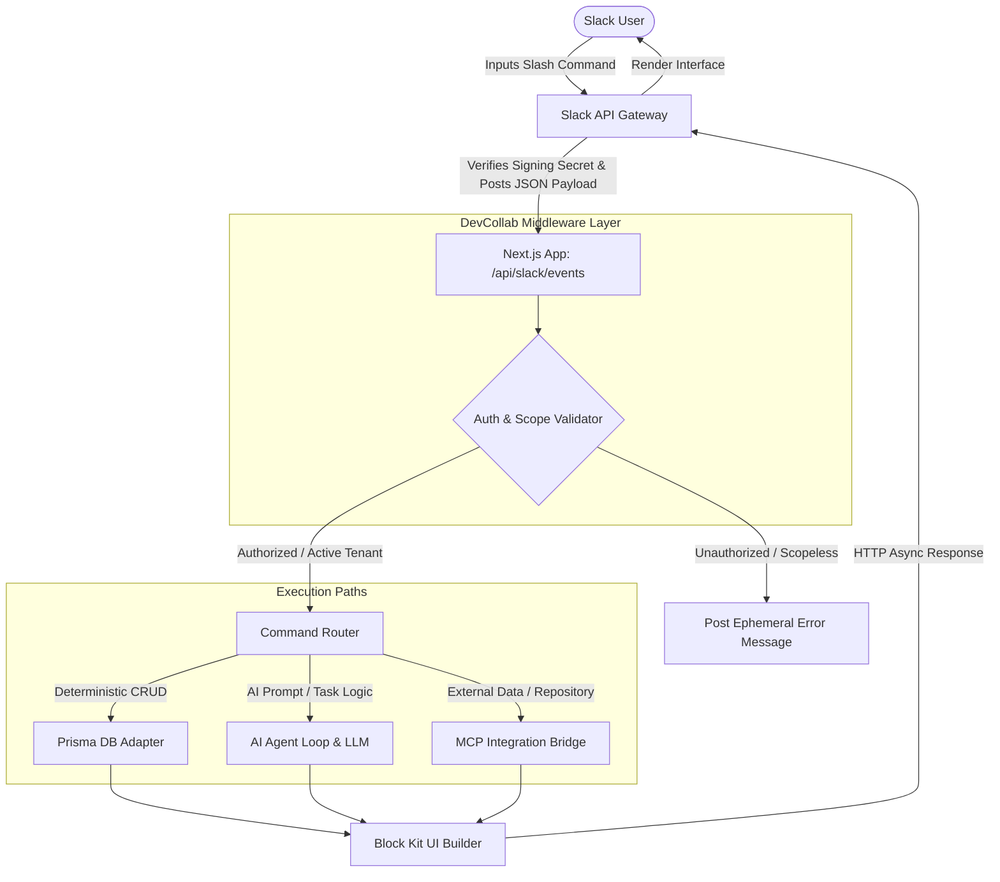

# 💬 Slack Command Dictionary & Integration Guide

> **DevCollab AI Workspace Intelligence Agent — Command Schema, Security, and Workflows**

---

## 🏗️ Command Execution Workflow

All DevCollab slash commands are processed through our Next.js backend. Commands that require LLM reasoning or external tool execution leverage our Model Context Protocol (MCP) router.

---

## 🛠️ Command Specifications

### 📊 Project Management Commands

#### 1. `/create-project`
*   **Description:** Instantiates a new project tracking entity inside the active workspace.
*   **Input Parameters:** 
    *   `name` (String, Required) - Name of the project.
    *   `description` (String, Optional) - Short summary of project targets.
*   **Expected Output:** Ephemeral confirmation card containing the project name, ID, and a button to "View on Kanban Dashboard".
*   **Example Usage:** `/create-project name: Payment Gateway Integration desc: Setup Stripe and PayPal API integrations.`

#### 2. `/project-status`
*   **Description:** Displays a high-level summary of active columns, task distribution, and completion rates.
*   **Input Parameters:** 
    *   `project_id` (String, Optional) - Specific project filter. If blank, lists all active projects in the workspace.
*   **Expected Output:** Block Kit dashboard card with progress bars showing: Completed tasks, In-Progress items, Backlog depth, and assignee counts.
*   **Example Usage:** `/project-status project_id: proj_9872`

#### 3. `/project-summary`
*   **Description:** Generates an AI-powered project synthesis highlighting key metrics, potential delays, and recent log events.
*   **Input Parameters:** 
    *   `project_id` (String, Required) - Target project ID.
*   **Expected Output:** Rich text report structured with sections: "Executive Summary", "Key Achievements", "Identified Risks", and "Recommended Focus Areas".
*   **Example Usage:** `/project-summary project_id: proj_1120`

---

### 📝 Task Management Commands

#### 4. `/create-task`
*   **Description:** Registers a new task issue on the kanban board.
*   **Input Parameters:** 
    *   `title` (String, Required) - Short title of the task.
    *   `priority` (Enum: High, Medium, Low; Default: Medium) - Task severity.
    *   `project` (String, Required) - Project name or ID.
*   **Expected Output:** Interactive Block Kit card showing task metadata with dropdown menus to reassign or change columns.
*   **Example Usage:** `/create-task title: Fix Auth session timeout priority: High project: DevCollab Core`

#### 5. `/generate-tasks`
*   **Description:** Automatically breaks down a user feature request into a checklist of distinct, actionable tasks.
*   **Input Parameters:** 
    *   `requirements` (String, Required) - Paragraph describing the feature or code goals.
    *   `project_id` (String, Required) - Target project.
*   **Expected Output:** A checklist panel showing draft tasks. User can check/uncheck tasks and click "Confirm and Seed Kanban Board".
*   **Example Usage:** `/generate-tasks project_id: proj_0987 requirements: Setup Redis caching for user sessions. Use Upstash, handle serialization, and verify eviction policies.`

#### 6. `/assign-task`
*   **Description:** Links a team member's account to a specific task card.
*   **Input Parameters:** 
    *   `task_id` (String, Required) - Target task.
    *   `assignee` (Mention, Required) - Slack username/ID.
*   **Expected Output:** Notification card posted to the channel announcing the assignment.
*   **Example Usage:** `/assign-task task_id: task_332 @SakthiSanjay`

---

### 🧠 Team Intelligence Commands

#### 7. `/team-status`
*   **Description:** Evaluates active workloads, task counts, and potential resource bottlenecks across all members.
*   **Input Parameters:** None.
*   **Expected Output:** Horizontal bar charts representing task loads per engineer. Overloaded members (5+ active tasks) are highlighted in amber.
*   **Example Usage:** `/team-status`

#### 8. `/team-insights`
*   **Description:** Outputs AI-driven performance summaries, code velocity statistics, and process recommendations.
*   **Input Parameters:** 
    *   `timeframe` (Enum: 7d, 30d, Sprint; Default: 7d) - Metrics scope.
*   **Expected Output:** Executive report tracking PR review durations, task completion speed, and workflow blockages.
*   **Example Usage:** `/team-insights timeframe: 30d`

---

### 💻 Code Generation & Engineering Commands

#### 9. `/generate-code`
*   **Description:** Writes boilerplate, algorithms, or testing suites based on input specifications.
*   **Input Parameters:** 
    *   `prompt` (String, Required) - Specifications and language requirement.
*   **Expected Output:** Collapsible code block with syntax formatting and a one-click "Create GitHub PR" button.
*   **Example Usage:** `/generate-code prompt: Write a Next.js API route that handles GitHub event signature verification using Webhook Secrets in TypeScript.`

#### 10. `/review-code`
*   **Description:** Reviews code snippets for security concerns, performance issues, and standards compliance.
*   **Input Parameters:** 
    *   `snippet_or_link` (String, Required) - Directly pasted code block or a link to a GitHub PR/file.
*   **Expected Output:** Structured review indicating: Code health score, Security warnings, Optimizations list, and corrected code revisions.
*   **Example Usage:** `/review-code snippet: const handleUserLogin = (user) => { let session = jwt.sign(user, 'my-super-secret'); return session; }`

#### 11. `/architecture`
*   **Description:** Generates layout, database modeling, and dependency flow recommendations for a system.
*   **Input Parameters:** 
    *   `concept` (String, Required) - The system module or feature idea.
*   **Expected Output:** Technical design document including schema patterns and a Mermaid block diagram representing the service layouts.
*   **Example Usage:** `/architecture concept: Implement a multi-tenant chat system with PostgreSQL for logs and Socket.io for real-time delivery.`

---

### 🔍 Knowledge Agent Commands

#### 12. `/search-docs`
*   **Description:** Searches connected organizational files (Google Drive, Notion) using semantic matching.
*   **Input Parameters:** 
    *   `query` (String, Required) - Search phrase.
*   **Expected Output:** AI-summarized answer with links to the source files.
*   **Example Usage:** `/search-docs query: What is our security policy for third-party API tokens?`

#### 13. `/search-project`
*   **Description:** Searches through active task records, database logs, and chat threads.
*   **Input Parameters:** 
    *   `query` (String, Required) - Search target.
*   **Expected Output:** List of matching task tickets, associated comments, and developer status log entries.
*   **Example Usage:** `/search-project query: stripe credentials bug`

---

### 🐙 GitHub MCP Commands

#### 14. `/github-summary`
*   **Description:** Evaluates active repositories to compile progress summaries and branch configurations.
*   **Input Parameters:** 
    *   `repo` (String, Required) - Name of the GitHub repository.
*   **Expected Output:** Summary card showing active branches, commit velocity, and build success percentages.
*   **Example Usage:** `/github-summary repo: DevCollab-AI`

#### 15. `/show-prs`
*   **Description:** Lists open pull requests, pending reviews, and merge conflicts.
*   **Input Parameters:** None.
*   **Expected Output:** Table of open PRs showing build status, reviewers, and links to the files changed.
*   **Example Usage:** `/show-prs`

#### 16. `/show-issues`
*   **Description:** Fetches open GitHub repository issues.
*   **Input Parameters:** 
    *   `priority` (String, Optional) - Filter by labels (e.g., 'bug', 'enhancement').
*   **Expected Output:** List of matching GitHub issue tickets with quick-links to open them in a browser.
*   **Example Usage:** `/show-issues priority: bug`

---

### 📁 Google Drive MCP Commands

#### 17. `/find-document`
*   **Description:** Scans shared Google Drive folders to locate documents.
*   **Input Parameters:** 
    *   `keyword` (String, Required) - Title or contents keyword.
*   **Expected Output:** List of matching files showing file type (Doc, Sheet, Slide), owner, last updated timestamp, and link.
*   **Example Usage:** `/find-document keyword: product requirements`

---

## 🔒 Permission Model

To maintain workspace security and audit trail integrity, command access levels are restricted by user role assignments:

| Command | Workspace Guest | Workspace Member | Workspace Admin |
| :--- | :---: | :---: | :---: |
| `/create-project` | ❌ Denied | ❌ Denied | ✅ Allowed |
| `/project-status` | ✅ Allowed | ✅ Allowed | ✅ Allowed |
| `/project-summary`| ❌ Denied | ✅ Allowed | ✅ Allowed |
| `/create-task` | ✅ Allowed | ✅ Allowed | ✅ Allowed |
| `/generate-tasks` | ❌ Denied | ✅ Allowed | ✅ Allowed |
| `/assign-task` | ❌ Denied | ✅ Allowed | ✅ Allowed |
| `/team-status` | ❌ Denied | ✅ Allowed | ✅ Allowed |
| `/team-insights` | ❌ Denied | ❌ Denied | ✅ Allowed |
| `/generate-code` | ❌ Denied | ✅ Allowed | ✅ Allowed |
| `/review-code` | ❌ Denied | ✅ Allowed | ✅ Allowed |
| `/architecture` | ❌ Denied | ✅ Allowed | ✅ Allowed |
| `/search-docs` | ❌ Denied | ✅ Allowed | ✅ Allowed |
| `/search-project` | ✅ Allowed | ✅ Allowed | ✅ Allowed |
| `/github-summary` | ❌ Denied | ✅ Allowed | ✅ Allowed |
| `/show-prs` | ❌ Denied | ✅ Allowed | ✅ Allowed |
| `/show-issues` | ❌ Denied | ✅ Allowed | ✅ Allowed |
| `/find-document` | ❌ Denied | ✅ Allowed | ✅ Allowed |

---

## 🔮 Future Command Expansion

We plan to support the following integrations and commands in upcoming cycles:

1.  **Deployment Integrations:**
    *   `/deploy-status` - Checks deployment status on Vercel, AWS, or GCP.
    *   `/rollback` - Initiates a safe rollback of the last code build to production.
2.  **DevOps & Logging Integration:**
    *   `/sentry-alerts` - Displays recent unhandled exceptions.
    *   `/query-logs` - Queries system runtime logs via natural language.
3.  **Communication & Sync Tools:**
    *   `/huddle-summary` - Transcribes active Slack huddle conversations into meeting notes.
    *   `/jira-sync` - Syncs tasks to Jira.
